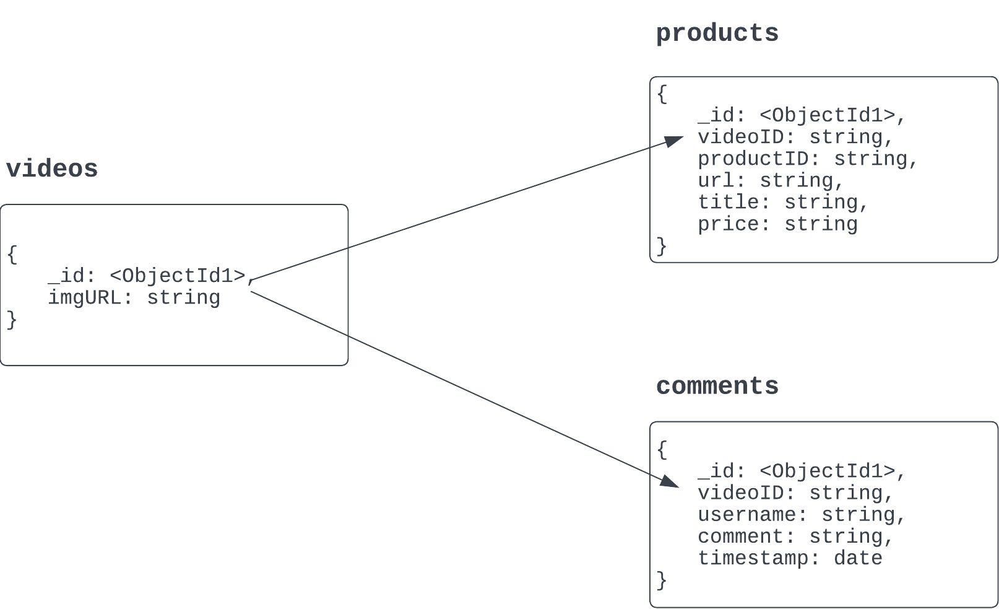
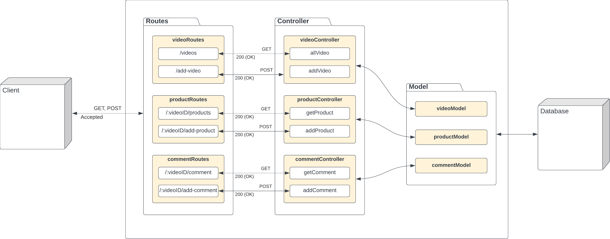

# 📹 Tokopedia Play Back-end 
This project is a development of back-end service for Tokopedia Play, submitted for the mid-term project of Full Stack Engineering on GIGIH 3.0 Program. It uses Node.js and Express.js for building the APIs and MongoDB for the database.

### 🗃️ Database Structure
MongoDB is utilized to store data (document) regarding to Tokopedia Play's requirements.
The database basically has 3 collections:
- `videos`
- `products`
- `comments`



**Products and comments collections are getting videoID from the videos collection.**
#### videos
This collection stored video thumbnail documents with the following schema:
```json
{
	"_id": "string",
	"imgURL": "string"
}
```

#### products
This collection stored product documents with the following schema:
```json
{
    "_id": "string",
    "videoID": "string",
    "productID": "string",
    "title": "string",
    "price": "string"
}
```

#### comments
This collection stored comments from the user with the following schema:
```json
{
    "_id": "string",
    "videoID": "string",
    "username": "string",
    "timestamp": "string"
}
```
## API's Structure

As the image shows, the back-end system consists of models, routes, and controllers, as well as MongoDB for the database.
- `routes` will act as a delivery between the system and the user, where routes will be the media of sending responses and receiving requests for the user. 
- `controllers`  have functions in it where it is positioned between routes and models. The controller will receive the request from `routes`, process it, and take the data needed from the `model` layer.
- `models` carries the data schema and works with the `controller` to handle data from the database.
- `user/client` acts as a party that will be sending request and receiving response from the system.

## API's Request and Response
## APIs for Videos
**Video object**
```json
{
	"imgURL": "string"
}
```
### GET /videos (required)
Returns all videos in the system.
* **URL Params**  
  None
* **Data Params**  
  None
* **Headers**  
  None
* **Success Response:**  
* **Code:** 200 OK
  **Content:**  
```json
[
    {
        "_id": "string",
        "imgURL": "string",
    },
    {
        "_id": "string",
        "imgURL": "string",
    }
]
```
### POST /add-video
Adds a new video and returns the new object.
* **URL Params**  
  None
* **Headers**  
  Content-Type: application/json  
* **Data Params**  
```json
  {
        "imgURL": "string"
  }
```
* **Success Response:**  
* **Code:** 200  
  **Content:** 
```json
{
    "message": "Video successfully added.",
    "savedVideo": {
        "imgURL": "string",
        "_id": "string",
    }
}
```
* **Error Response:**  
  * **Code:** 500  
  **Content:** 
```
{
    "message": "Failed to add video."
}
```
## APIs for Products
**Product object**
```json
{
    "videoID": "string",
    "productID": "string",
    "title": "string",
    "price": "string"
}
```
### GET /:videoID/products (required)
Returns all videos in the system.
* **URL Params**  
  http://localhost:5000/videoID/products
* **Data Params**  
  None
* **Headers**  
  None
* **Success Response:**  
* **Code:** 200 OK
  **Content:**  
```json
[
    {
        "_id": "string",
        "videoID": "string",
        "productID": "string",
        "url": "string",
        "title": "string",
        "price": "string",
    }
]
```
* **Error Response:**  
  * **Code:** 500  
  **Content:** 
```
{
    "message": "No product available."
}
```
### POST /:videoID/add-product
Adds a new product in a video and returns the new object.
* **URL Params**  
  None
* **Headers**  
  Content-Type: application/json  
* **Data Params**  
```
  {
        "productID": "string",
        "url": "string",
        "title": "string",
        "price": "string",
  }
```
* **Success Response:**  
* **Code:** 200  
  **Content:** 
```json
{
    "message": "Product successfully added.",
    "savedProduct": {
        "videoID": "string",
        "productID": "string",
        "url": "string",
        "title": "string",
        "price": "string",
        "_id": "string",
    }
}
```
* **Error Response:**  
  * **Code:** 500  
  **Content:** 
```
{
    "message": "Failed to add product."
}
```
## APIs for Comments
**Comment object**
```json
{
    "username": "string",
    "comment": "string",
    "timestamp": "Date",
}
```
### GET /:videoID/get-comment (required)
Returns comments in a video.
* **URL Params**  
  http://localhost:5000/videoID/get-comment
* **Data Params**  
  None
* **Headers**  
  None
* **Success Response:**  
* **Code:** 200 OK
  **Content:**  
```json
[
    {
        "_id": "string",
        "videoID": "string",
        "username": "string",
        "comment": "string",
        "timestamp": "string",
    }
]
```
* **Error Response:**  
  * **Code:** 500  
  **Content:** 
```
{
    "message": "No comments here. Be the first one!"
}
```
### POST /:videoID/add-comment (required)
Adds a new comment in a video and returns the new object.
* **URL Params**  
  None
* **Headers**  
  Content-Type: application/json  
* **Data Params**  
```json
{
    "username": "string",
    "comment": "string"
}
```
* **Success Response:**  
* **Code:** 200  
  **Content:** 
```
{
    "message": "Comment successfully added",
    "savedComment": {
        "videoID": "string",
        "username": "string",
        "comment": "string",
        "_id": "string",
        "timestamp": "string",
    }
}
```
* **Error Response:**  
  * **Code:** 500  
  **Content:** 
```
{
    "message": "Failed to add comment."
}
```

## How to Run in Local
Clone this repository
```
https://github.com/hanasabila/midterm-tokopedia-play.git
```
Install the packages needed
```bash
npm install express mongoose body-parser nodemon dotenv cors
```
Use ```npm start``` to run the program. But since we have installed `nodemon`, you could use it to automatically restart the server every time you make changes. To use `nodemon`, follow this step:

- Go to `packages.json` file
- Look for `"scripts"` in the code
- Below `"test"` write this: `"start": "nodemon index.js"`. Don't forget to use the comma (,) at the end of the `test` line.

Open `.env` file in the folder, then set your database connection.

### Thankyou!

